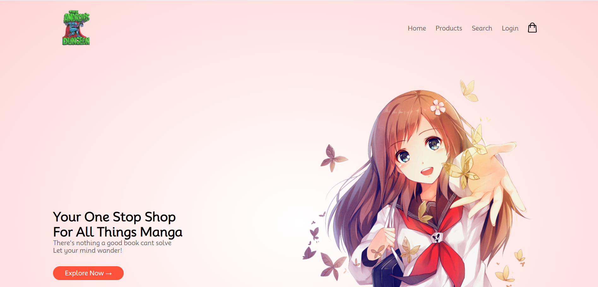
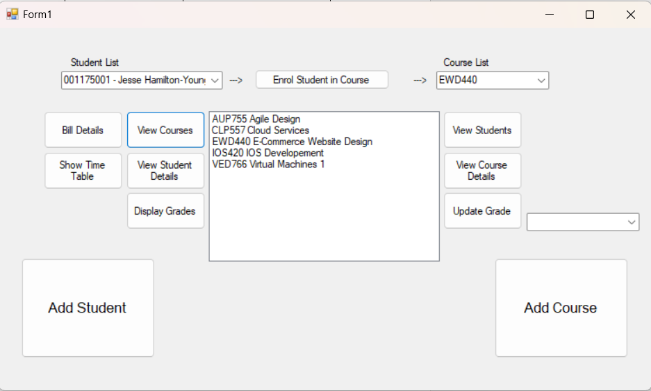
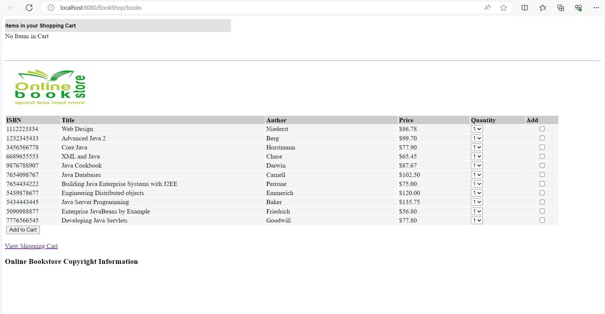
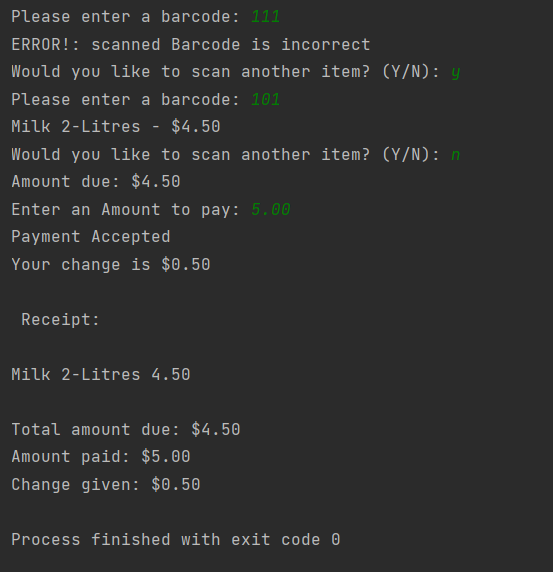
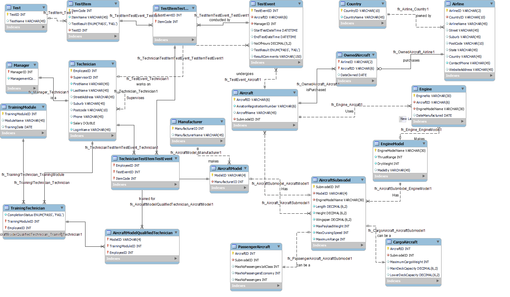
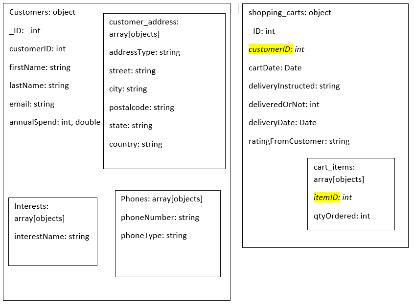

# Portfolio
Welcome to my portfolio, showcasing a diverse collection of projects developed during my academic journey. This compilation highlights my proficiency in various programming languages and provides insight into my coding expertise.  

## Purpose
This portfolio serves as a comprehensive guide for prospective employers, offering a glimpse into my coding experience and proficiency level. Explore the projects below to gain a better understanding of my skills.  

## Projects
### AndroidsDungeon E-Commerce Website
This project focuses on creating a faux storefront for a comic book store. It demonstrates my proficiency in web development, e-commerce, and user interface design.
[A version can be found hosted here](https://androidsdungeon.free.nf/)
  

### Student Enrolment System Cloud solution
This student enrollment system, written in C#, showcases my expertise in cloud computing, database management, and client-server architecture. It emphasizes my ability to develop scalable and efficient solutions for educational institutions.
  

### Node/Adonis JS Rest API
This project highlights my skills in backend development, RESTful API design, and database integration. It demonstrates my proficiency in creating robust and scalable web services using Node.js and AdonisJS.

Postman documentation for this API can be found [here](https://documenter.getpostman.com/view/27357950/2s93z58jNF)  

### Java Enterprise Book Shop
This Java enterprise application showcases my expertise in enterprise software development, Java programming, and web application deployment. It highlights my ability to build scalable systems for business needs.
  

### Python Supermarket Checkout System
This Python project demonstrates my proficiency in object-oriented programming, algorithm design, and software engineering principles. It showcases my ability to develop efficient and maintainable solutions for real-world problems.  

### C# algorithm Experience
This project demonstrates my expertise in data structures, algorithm design, and .NET framework. It highlights my ability to implement and optimize algorithms, as well as work with different data structures to solve complex problems efficiently.

### Agile Methodology and UML experience
This project showcases my experience in software development methodologies, including Agile and UML. It demonstrates my ability to collaborate effectively in a team, analyze requirements, and design scalable solutions using UML diagrams.

a copy of the Final assignment with each members parts labeled clearly, can be found [here](https://docs.google.com/document/d/1HiDwRAqUs1Bj7arR8uxGVVhfp_001O1d/edit?usp=sharing&ouid=112035954168563845230&rtpof=true&sd=true)  

## Database Experience
### MySQL
This project demonstrates my expertise in database design, SQL programming, and data modeling. It emphasizes my ability to create normalized and efficient database schemas to meet business requirements.
  

### MongoDB
This project highlights my experience with NoSQL databases and document-oriented data modeling. It showcases my ability to design flexible and scalable database schemas for modern web applications.
  

Feel free to explore each project for a deeper insight into my coding capabilities and problem-solving skills. If you have any questions or would like further details on specific projects, don't hesitate to reach out. Thank you for visiting my portfolio!
